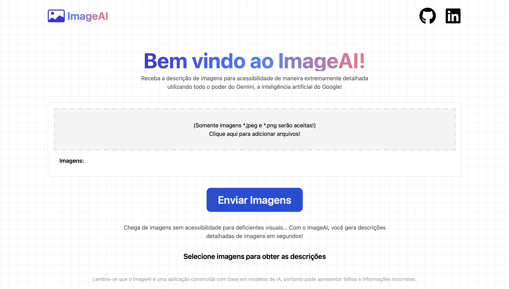
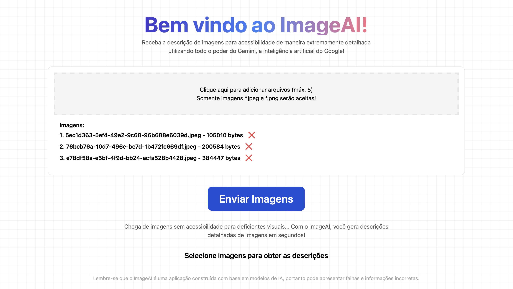
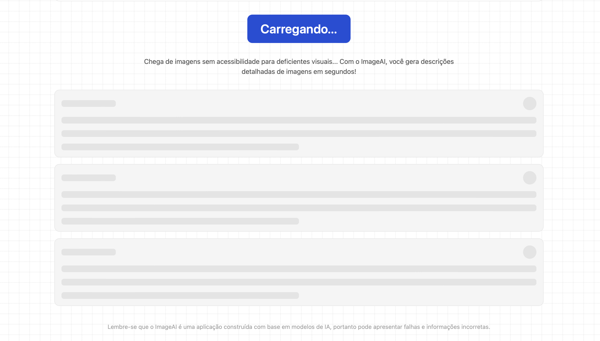
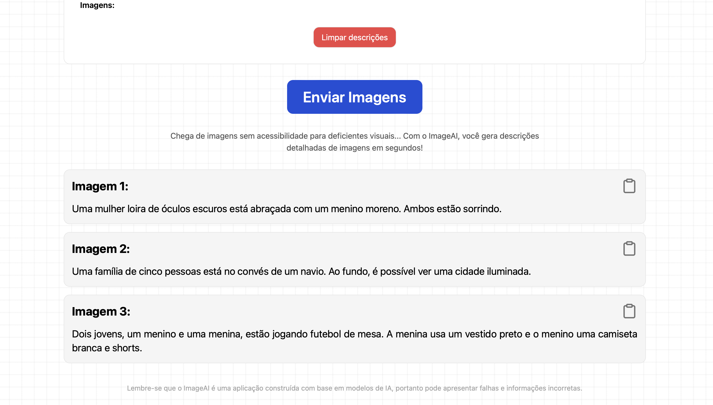

<h1>ImageAI</h1>

> Status do Projeto: Finalizado (May 05, 2024)

## A aplicação está disponível em: [https://image-ai-enzobozzani.vercel.app](https://image-ai-enzobozzani.vercel.app)

Imagens demonstrativas:






## Descrição do projeto

<p align="justify">
   ImageAI é uma aplicação web construída com TypeScript e Next.js usando a API do Gemini para gerar descrições detalhadas das imagens, melhorando a acessibilidade para deficientes visuais..
</p>

## Tech Stack

:warning: Gemini API
<br>
:warning: NodeJS
<br>
:warning: TypeScript
<br>
:warning: ReactJS
<br>
:warning: NextJS
<br>
:warning: TailwindCSS

## Rodar aplicação:

Clone project:

```
git clone https://github.com/EnzoBozzani/image-ai.git
```

Configurar variáveis de ambiente:

```
NEXT_PUBLIC_API_KEY=
```

Install dependencies:

```
npm install
```

Run project:

```
npm run dev
```
